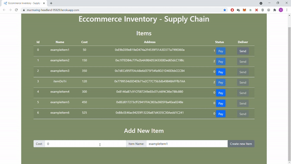
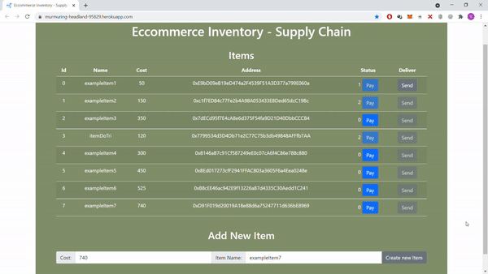
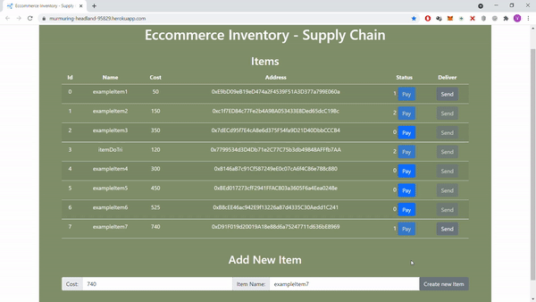

<!--
*** Thanks for checking out the Best-README-Template. If you have a suggestion
*** that would make this better, please fork the repo and create a pull request
*** or simply open an issue with the tag "enhancement".
*** Thanks again! Now go create something AMAZING! :D
-->

<!-- PROJECT SHIELDS -->
<!--
*** I'm using markdown "reference style" links for readability.
*** Reference links are enclosed in brackets [ ] instead of parentheses ( ).
*** See the bottom of this document for the declaration of the reference variables
*** for contributors-url, forks-url, etc. This is an optional, concise syntax you may use.
*** https://www.markdownguide.org/basic-syntax/#reference-style-links
-->

[![Contributors][contributors-shield]][contributors-url]
[![Forks][forks-shield]][forks-url]
[![Stargazers][stars-shield]][stars-url]
[![Issues][issues-shield]][issues-url]
[![MIT License][license-shield]][license-url]
[![LinkedIn][linkedin-shield]][linkedin-url]

<!-- PROJECT LOGO -->
<br />
<p align="center">
  <a href="https://murmuring-headland-95829.herokuapp.com/">
    
  </a>

  <h3 align="center">Eccommerce Inventory - Supply Chain</h3>

  <p align="center">
    An Inventory Manager demo using Solidity, React, Truffle, Web3 and OpenZeppelin.
    <br />
    <a href="https://github.com/vinivst/SupplyChain/#getting-started"><strong>Explore the docs »</strong></a>
    <br />
    <br />
    <a href="https://murmuring-headland-95829.herokuapp.com/">View Demo</a>
    ·
    <a href="https://github.com/vinivst/SupplyChain/issues">Report Bug</a>
    ·
    <a href="https://github.com/vinivst/SupplyChain/issues">Request Feature</a>
  </p>
</p>

<!-- TABLE OF CONTENTS -->
<details open="open">
  <summary>Table of Contents</summary>
  <ol>
    <li>
      <a href="#about-the-project">About The Project</a>
      <ul>
        <li><a href="#built-with">Built With</a></li>
      </ul>
    </li>
    <li>
      <a href="#getting-started">Getting Started</a>
      <ul>
        <li><a href="#prerequisites">Prerequisites</a></li>
        <li><a href="#installation">Installation</a></li>
      </ul>
    </li>
    <li><a href="#usage">Usage</a></li>
    <li><a href="#roadmap">Roadmap</a></li>
    <li><a href="#contributing">Contributing</a></li>
    <li><a href="#license">License</a></li>
    <li><a href="#contact">Contact</a></li>
    <li><a href="#acknowledgements">Acknowledgements</a></li>
  </ol>
</details>

<!-- ABOUT THE PROJECT -->

## About The Project

[![Product Name Screen Shot][product-screenshot]](https://murmuring-headland-95829.herokuapp.com/)

An Inventory Manager implemented in Rinkeby Test Network that allows you to:

- Register a new item
- Pay for the item
- "Send" the item for customer
- Track the status of all items

Whenever a item changes it's status, an event is emitted by the smart contract and the React interface is listening to update the UI accordingly.

There are 3 events:

    - When a new item is created;
    - When an item is paid;
    - When an item is sent;

And 3 possible status:

    - 0: Item created;
    - 1: Item was paid;
    - 2: Item was sent;

A list of commonly used resources that I find helpful are listed in the acknowledgements.

### Built With

- [Solidity](https://soliditylang.org/)
- [React](https://reactjs.org/)
- [Reactstrap](https://reactstrap.github.io/)
- [Truffle](https://www.trufflesuite.com/)
- [Web3](https://web3js.readthedocs.io/)
- [Metamask](https://metamask.io/)
- [OpenZeppelin](https://openzeppelin.com/)

<!-- GETTING STARTED -->

## Getting Started

In the following sections you will learn how to clone this repo and get it up and running in no time.

### Prerequisites

You need to have npm installed.

- Download and install node, which already comes with npm:
  - [Download Node](https://nodejs.org/en/download/)

### Installation

1. Clone the repo (--recurse-submodules to include the client's submodule folder)
   ```sh
   git clone --recurse-submodules https://github.com/vinivst/SupplyChain.git
   ```
2. Install NPM packages in project ("backend")
   ```sh
   npm install
   ```
3. Install NPM packages in client
   ```sh
   cd client
   npm install
   ```
4. Register a new account in [Infura](https://infura.io/) and create a new project to get your rinkeby key at
   https://infura.io/dashboard/ethereum

5. Create a .env file at root path

6. Create the MNEMONIC (12 words seed phrase from your wallet) and INFURA_KEY (that you got from step 3) inside .env and save
   ```sh
   MNEMONIC = globe nephew genre emotion morning best penalty trade bid glare unaware dragon
   INFURA_KEY = https://rinkeby.infura.io/v3/you_key_here
   ```
7. Deploy your smart contracts
   ```sh
   truffle migrate --network rinkeby
   ```
8. Change to client directory and run react
   ```sh
   cd client
   npm start
   ```
9. Enjoy your own Inventory Manager on chain! :smile:

<!-- USAGE EXAMPLES -->

## Usage (Metamask didn't shows in the gifs)

Manager can create a new item:



Then a customer can pay for an item:



When an item is paid, manager can send the item to the customer:



<!-- ROADMAP -->

## Roadmap

See the [open issues](https://github.com/vinivst/SupplyChain/issues) for a list of proposed features (and known issues).

<!-- CONTRIBUTING -->

## Contributing

Contributions are what make the open source community such an amazing place to be learn, inspire, and create. Any contributions you make are **greatly appreciated**.

1. Fork the Project
2. Create your Feature Branch (`git checkout -b feature/AmazingFeature`)
3. Commit your Changes (`git commit -m 'Add some AmazingFeature'`)
4. Push to the Branch (`git push origin feature/AmazingFeature`)
5. Open a Pull Request

<!-- LICENSE -->

## License

Distributed under the GNU GPLv3 License. See `LICENSE` for more information.

<!-- CONTACT -->

## Contact

Vinicius Santiago - [Linkedin](https://www.linkedin.com/in/vinivst/)

Project Link: [https://github.com/vinivst/SupplyChain](https://github.com/vinivst/SupplyChain)

<!-- ACKNOWLEDGEMENTS -->

## Acknowledgements

- [GitHub Emoji Cheat Sheet](https://www.webpagefx.com/tools/emoji-cheat-sheet)
- [Best-README-Template](https://github.com/othneildrew/Best-README-Template)
- [Choose an Open Source License](https://choosealicense.com)

<!-- MARKDOWN LINKS & IMAGES -->
<!-- https://www.markdownguide.org/basic-syntax/#reference-style-links -->

[contributors-shield]: https://img.shields.io/github/contributors/vinivst/SupplyChain.svg?style=for-the-badge
[contributors-url]: https://github.com/vinivst/SupplyChain/graphs/contributors
[forks-shield]: https://img.shields.io/github/forks/vinivst/SupplyChain.svg?style=for-the-badge
[forks-url]: https://github.com/vinivst/SupplyChain/network/members
[stars-shield]: https://img.shields.io/github/stars/vinivst/SupplyChain.svg?style=for-the-badge
[stars-url]: https://github.com/vinivst/SupplyChain/stargazers
[issues-shield]: https://img.shields.io/github/issues/vinivst/SupplyChain.svg?style=for-the-badge
[issues-url]: https://github.com/vinivst/SupplyChain/issues
[license-shield]: https://img.shields.io/github/license/vinivst/SupplyChain.svg?style=for-the-badge
[license-url]: https://github.com/vinivst/SupplyChain/blob/master/LICENSE.txt
[linkedin-shield]: https://img.shields.io/badge/-LinkedIn-black.svg?style=for-the-badge&logo=linkedin&colorB=555
[linkedin-url]: https://www.linkedin.com/in/vinivst/
[product-screenshot]: ./images/screenshot.PNG
